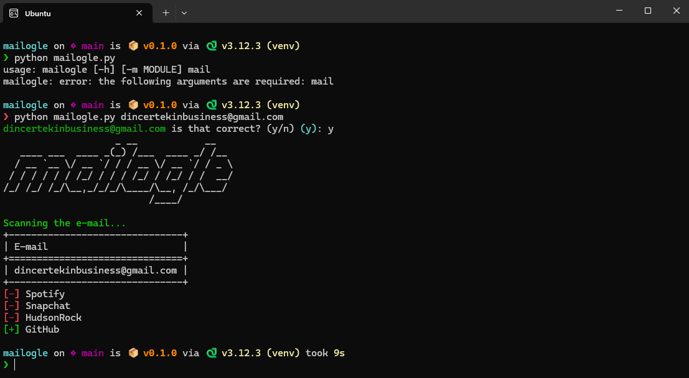

# mailogle
Mailogle is an OSINT tool that helps find email addresses on websites like GitHub, Spotify, Instagram, and Snapchat. This tool is useful for gathering open-source intelligence in a simple way.  
**NOTE:** This tool is designed for educational purposes only, author is not responsible for illegal uses.

## Screenshots


## Installation
There is two different ways to install mailogle, using pypoetry and using only pip.

#### Installing with pip
Use these commands on Linux:
```bash
git clone https://github.com/dincertekin/mailogle.git
cd mailogle/
pip install -r requirements.txt
python mailogle.py
```

#### Installing with pypoetry
Use these commands on Linux:
```bash
git clone https://github.com/dincertekin/mailogle.git
cd mailogle/
poetry install
python mailogle.py
```

## Contributions
Contributions are very welcome! We can improve this tool together! 😊

## License
This project is licensed under [Apache-2.0 License](LICENSE).

## Thanks
This project is inspired by megadose's [holehe](https://github.com/megadose/holehe).
