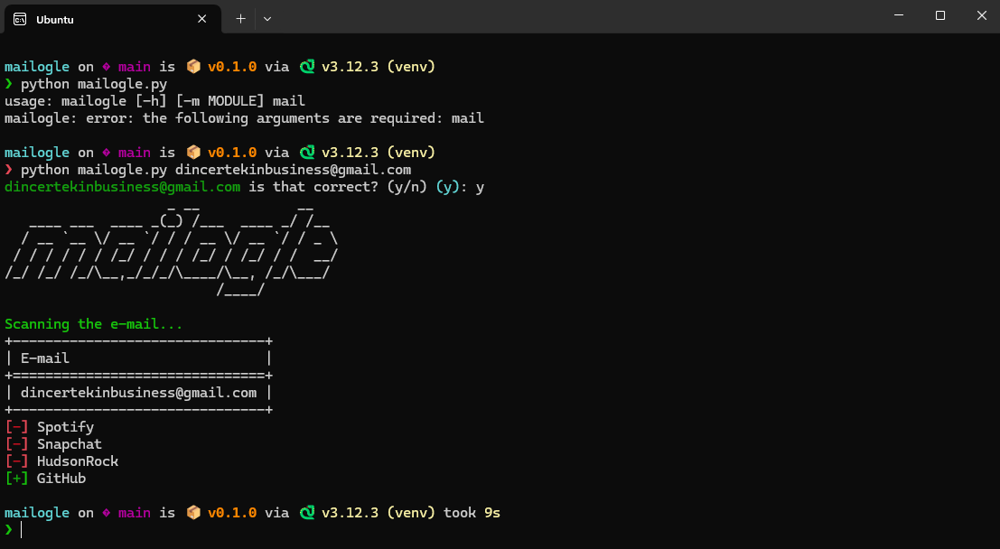

# mailogle


mailogle is a Python-based OSINT tool for finding email addresses associated with accounts on platforms like GitHub, Spotify, Instagram, and Snapchat. Inspired by [holehe](https://github.com/megadose/holehe).

> This tool is intended for educational purposes only. The author is not responsible for any illegal use.

## Screenshots



## Tech Stack

| Layer | Tool |
|---|---|
| Language | Python 3 |
| Package Manager | pip / Poetry |
| Platform | Linux |

## Installation

1. Clone the repository:
   ```bash
   git clone https://github.com/dincertekin/mailogle.git
   cd mailogle/
   ```

2. Install dependencies using pip or Poetry:
   ```bash
   pip install -r requirements.txt
   # or
   poetry install
   ```

## Usage

```bash
python mailogle.py
```

If you run into dependency issues, make sure pip is up to date:
```bash
pip install --upgrade pip
```

## Contributing

Contributions are welcome! To get started:

1. Fork the repository.
2. Create a new branch (`git checkout -b feature/your-feature`).
3. Commit your changes (`git commit -m 'Add your feature'`).
4. Push to the branch (`git push origin feature/your-feature`).
5. Open a Pull Request.

For major changes, please open an issue first to discuss what you'd like to change.

## License

MIT License — see [LICENSE](./LICENSE) for details.
